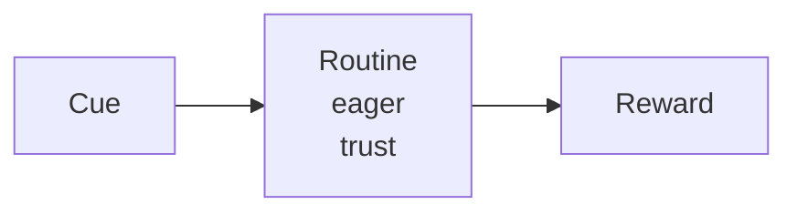

# Metadata
Status ::
Type :: #Books/life
Summary :: 
Topics :: 
# Note
## The basic rule

```mermaid
flowchart LR

A[Cue] -->B[Routine <br> eager <br> trust]
B --> C[Reward]
```

* How new habits are created Cue-> Routine ->Reward, cultivating a craving that drive the loop.