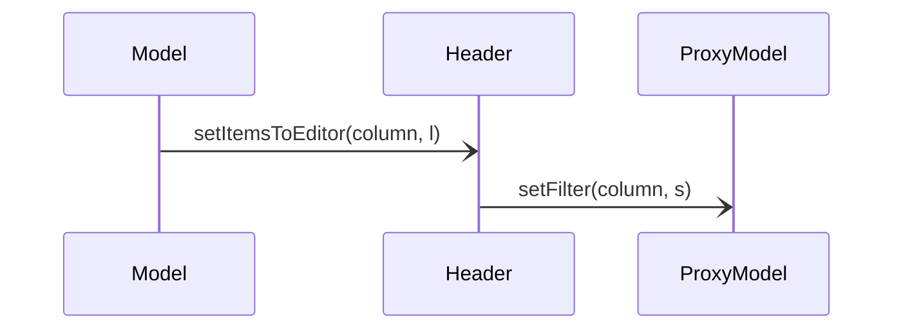

# Basic MainWindow flow
```python
import sys

from PySide2.QtWidgets import QApplication, QWidget, QVBoxLayout, QDialog, \
  QLabel, QLineEdit, QDialogButtonBox, QMenu, QAction
# from PySide2.QtGui import QAction
from PySide2.QtUiTools import QUiLoader
from PySide2.QtCore import QFile, Signal, Slot, QPoint, Qt
from PySide2.QtCore import QIODevice, QModelIndex
class DwaWidget(QWidget):
  def __init__(self, parent=None):
    super().__init__(parent)
    '''
    define ui file and set to widget
    '''    
    ui_file_name = "/remote/hsim_eng2/ktc/ktc_dev_dwa/dwa/src/ccGui/DwaWidget.ui"
    ui_file = QFile(ui_file_name)
    if not ui_file.open(QIODevice.ReadOnly):
      print(f"Cannot open {ui_file_name}: {ui_file.errorString()}")
      sys.exit(-1)
    loader = QUiLoader()
    self.ui = loader.load(ui_file)
    layout = QVBoxLayout(self)
    layout.addWidget(self.ui)
    '''
    end of import ui file
    '''
    self.__model = Model.Model(self)
    self.ui.treeViewTestbenches.setModel(self.__model.testbenchesModel())
    self.ui.treeViewTestbenches.setContextMenuPolicy(Qt.CustomContextMenu)
    self.ui.treeViewTestbenches.customContextMenuRequested.\
      connect(self.onCustomContextMenu)
    # self.ui.treeViewTestbenches.doubleClicked.connect(self.addTestbench)
    self.ui.treeViewTestbenches.doubleClicked.connect(self.addTb)
    self.ui.treeViewTestbenches.clicked.connect(self.onTreeViewTbsClicked)
    self.initContextMenu()
    self.initGuiSignals()
    '''
    connect model signal to slot 
    '''
    self.__model.currentTbChanged.connect(self.onTbChanged)
  def initContextMenu(self) :
    self.contextMenuTb = QMenu()
    self.actionAddDrp = QAction('Add Drp Analysis')
    self.actionAddDrp.triggered.connect(self.addDrp)
    self.actionAddDra = QAction('Add Dra Analysis')
    self.actionAddDra.triggered.connect(self.addDra)
    self.actionDelTb = QAction('Delete Testbench')
    self.actionDelTb.triggered.connect(self.delTb)
    self.actionMoveUpTb = QAction('Move Up Testbench')
    self.actionMoveUpTb.triggered.connect(self.moveUpTb)
    self.actionMoveDownTb = QAction('Move Down Testbench')
    self.actionMoveDownTb.triggered.connect(self.moveDownTb)
    self.contextMenuTb.addAction(self.actionAddDrp)
    self.contextMenuTb.addAction(self.actionAddDra)
    self.contextMenuTb.addAction(self.actionDelTb)
    self.contextMenuTb.addAction(self.actionMoveUpTb)
    self.contextMenuTb.addAction(self.actionMoveDownTb)

    self.contextMenuAna = QMenu()
    self.actionDelAna = QAction('Delete Analysis')
    self.actionMoveUpAna = QAction('Move Up Analysis')
    self.actionMoveDownAna = QAction('Move Down Analysis')
    self.actionDelAna.triggered.connect(self.delAna)
    self.actionMoveUpAna.triggered.connect(self.moveUpAna)
    self.actionMoveDownAna.triggered.connect(self.moveDownAna)
    self.contextMenuAna.addAction(self.actionDelAna)
    self.contextMenuAna.addAction(self.actionMoveUpAna)
    self.contextMenuAna.addAction(self.actionMoveDownAna)

  @Slot(QModelIndex)
  def onTreeViewTbsClicked(self, index):
    self.__model.tbChanged(index)
    pass
  '''
  sample for slot
  '''
  @Slot(QModelIndex)
  def addTb(self, index):
    self.__model.addTb(index)
    pass

  @Slot(QModelIndex)
  def delTb(self):
    index = self.sender().data()
    self.__model.delTb(index)
    pass

  @Slot(QModelIndex)
  def moveUpTb(self):
    index = (self.sender()).data()
    self.__model.moveUpTb(index)
    pass

  @Slot(QModelIndex)
  def moveDownTb(self):
    index = self.sender().data()
    self.__model.moveDownTb(index)
    pass

  @Slot(QModelIndex)
  def addDrp(self):
    index = self.sender().data()
    self.__model.addDrp(index)
    pass

  @Slot(QModelIndex)
  def addDra(self):
    index = self.sender().data()
    self.__model.addDra(index)
    pass

  @Slot(QModelIndex)
  def delAna(self):
    index = self.sender().data()
    self.__model.delAna(index)
    pass

  @Slot(QModelIndex)
  def moveUpAna(self):
    index = self.sender().data()
    self.__model.moveUpAna(index)
    pass

  @Slot(QModelIndex)
  def moveDownAna(self):
    index = self.sender().data()
    self.__model.moveDownAna(index)
    pass

  @Slot(QPoint)
  def onCustomContextMenu(self, p):
    index = self.ui.treeViewTestbenches.indexAt(p)
    if self.__model.isTbIndex(index) :
      l = self.contextMenuTb.actions()
      for a in l:
        a.setData(index)
      self.contextMenuTb.exec_(self.ui.treeViewTestbenches.viewport().\
                               mapToGlobal(p))
    elif self.__model.isAnaIndex(index) :
      l = self.contextMenuAna.actions()
      for a in l:
        a.setData(index)
      self.contextMenuAna.exec_(self.ui.treeViewTestbenches.viewport().\
                                mapToGlobal(p))
    pass

  @Slot(QModelIndex)
  def onTbChanged(self) :
    self.ui.treeViewTestbenches.setCurrentIndex(self.__model.currentIndex())
    type = self.__model.currentType()
    if type == ItemType.TB.value:
      self.ui.stackedWidget.setCurrentIndex(2)
      pass
    elif type == ItemType.DRP.value:
      self.ui.stackedWidget.setCurrentIndex(0)
      pass
    elif type == ItemType.DRA.value:
      self.ui.stackedWidget.setCurrentIndex(1)
      pass
    print('tbChanged: {}'.format(self.__model.currentName()))
    pass

  def initGuiSignals(self):
    self.ui.comboBoxSyntax.currentTextChanged.connect(self.on_comboBoxSyntax_currentTextChanged)
    self.ui.lineEditNetlist.editingFinished.connect(self.on_lineEditNetlist_editingFinished)
    self.ui.lineEditCmdSuffix.editingFinished.connect(self.on_lineEditCmdSuffix_editingFinished)
    self.ui.lineEditDpConfig.editingFinished.connect(self.on_lineEditDpConfig_editingFinished)
    self.ui.spinBoxDpNum.valueChanged.connect(self.on_spinBoxDpNum_valueChanged)
    self.ui.lineEditTemperature.editingFinished.connect(self.on_lineEditTemperature_editingFinished)
    self.ui.pushButtonRun.clicked.connect(self.on_pushButtonRun_clicked)
    self.ui.pushButtonViewHistogram.clicked.connect(self.on_pushButtonViewHistogram_clicked)
    pass
  @Slot(str)
  def on_comboBoxSyntax_currentTextChanged(self, s):
    self.__model.setSyntax(s)
    pass
  @Slot()
  def on_lineEditNetlist_editingFinished(self):
    t = self.ui.lineEditNetlist.text()
    self.__model.setNetlist(t)
    pass 
  @Slot()
  def on_lineEditCmdSuffix_editingFinished(self):
    t = self.ui.lineEditCmdSuffix.text()
    self.__model.setCmdSuffix(t)
    pass 
  @Slot()
  def on_lineEditDpConfig_editingFinished(self):
    t = self.ui.lineEditDpConfig.text()
    self.__model.setDpConfig(t)
    pass
  @Slot(int)
  def on_spinBoxDpNum_valueChanged(self, i):
    self.__model.setDpNum(i)
    pass
  @Slot()
  def on_lineEditTemperature_editingFinished(self):
    t = self.ui.lineEditTemperature.text()
    self.__model.setTemperature(t)
    pass
  @Slot()
  def on_pushButtonRun_clicked(self):
    self.__model.run()
    pass
  @Slot()
  def on_pushButtonViewHistogram_clicked(self):
    self.__model.viewHistogram()
    pass
  
if __name__ == "__main__":
  app = QApplication(sys.argv)
  widget = DwaWidget()
  widget.show()
  sys.exit(app.exec_())
```
# Signal flow
```python
from PySide2.QtWidgets import QVBoxLayout, QDialog, QLabel, QLineEdit, \
  QDialogButtonBox
from PySide2.QtGui import QStandardItemModel, QStandardItem
from PySide2.QtCore import QModelIndex, Qt, QObject
from PySide2.QtCore import Signal, Slot
from Item import Testbench, Drp, Dra, ItemType
import DwaWidget

class NameDialog(QDialog):
  def __init__(self, name, parent=None):
    super().__init__(parent)
    self.__label = QLabel(name)
    self.__lineEditName = QLineEdit()
    self.__buttonBox = QDialogButtonBox(QDialogButtonBox.Ok |
                                        QDialogButtonBox.Cancel)
    l = QVBoxLayout(self)
    l.addWidget(self.__label)
    l.addWidget(self.__lineEditName)
    l.addWidget(self.__buttonBox)
    self.__buttonBox.accepted.connect(self.accept)
    self.__buttonBox.rejected.connect(self.reject)
    
  def accept(self):
    super().accept()
  def reject(self):
    super().reject()
  def name(self):
    return self.__lineEditName.text()
  
class Model(QObject):
  '''
  create signal
  '''
  currentTbChanged = Signal()
  def __init__(self, widget, parent=None):
    super().__init__(parent)
    self.__widget = widget
    self.__tbsModel = QStandardItemModel()
    item = QStandardItem('<Add Testbench>')
    item.setFlags(item.flags() & ~Qt.ItemIsEditable)
    self.__tbsModel.insertRow(0, item)
    item = QStandardItem('Testbenches')
    self.__tbsModel.setHorizontalHeaderItem(0, item)
    self.__items = {}
    self.__currentItem = None
    pass 

  def currentIndex(self) :
    return self.__currentItem.index()

  def currentType(self) :
    return self.__currentItem.type()

  def currentName(self):
    return self.__currentItem.text()
  
  def testbenchesModel(self) :
    return self.__tbsModel
  
  def addTb(self, index):
    if (index.parent() != QModelIndex()) or \
       (index.row() < (self.__tbsModel.rowCount() - 1)):
      return
    d = NameDialog("Testbench Name:")
    r = d.exec()
    tbName = d.name()
    if tbName and (not tbName in self.__items) and (r == QDialog.Accepted):
      tb = Testbench(tbName)
      self.__tbsModel.insertRow(self.__tbsModel.rowCount() - 1, tb)
      self.__items[tbName] = tb
      self.__currentItem = tb
      '''
      emit signal
      '''
      self.currentTbChanged.emit()
    pass
  
  def isTbIndex(self, index) :
    if (index.parent() == QModelIndex()) and \
       (index.row() < (self.__tbsModel.rowCount() - 1)):
      return True
    return False

  def isAnaIndex(self, index) :
    if (index.parent() != QModelIndex()):
      return True
    return False

  def delTb(self, index):
    item = self.__tbsModel.itemFromIndex(index)
    for i in range(item.rowCount()) :
      childItem = item.child(i)
      del self.__items[childItem.text()]
    del self.__items[item.text()]
    self.__tbsModel.removeRows(index.row(), 1)
    self.__currentItem = None
    if (self.__tbsModel.rowCount() > 1) :
      item = self.__tbsModel.item(0)
      self.__currentItem = item
    if self.__currentItem:
      self.currentTbChanged.emit()
    pass

  def moveUpTb(self, index):
    if (index.row() <= 0):
      return
    item = self.__tbsModel.itemFromIndex(index)
    self.__currentItem = item
    l = self.__tbsModel.takeRow(index.row())
    self.__tbsModel.insertRow(index.row() - 1, l)
    self.currentTbChanged.emit()
    pass
  
  def moveDownTb(self, index):
    if (index.row() >= self.__tbsModel.rowCount()-2):
      return
    item = self.__tbsModel.itemFromIndex(index)
    self.__currentItem = item
    l = self.__tbsModel.takeRow(index.row())
    self.__tbsModel.insertRow(index.row() + 1 , l)
    self.currentTbChanged.emit()
    pass

  def tbChanged(self, index):
    if index.parent() == QModelIndex() and \
       index.row() == self.__tbsModel.rowCount() - 1:
      return

    item = self.__tbsModel.itemFromIndex(index)
    if id(self.__currentItem) != id(item) :
      self.__currentItem = item
      self.currentTbChanged.emit()
    pass

  def addDrp(self, index):
    tbItem = self.__tbsModel.itemFromIndex(index)
    d = NameDialog("Drp Name:")
    r = d.exec()
    drpName = d.name()
    if drpName and (not drpName in self.__items) and (r == QDialog.Accepted):
      drpItem = tbItem.addDrp(drpName)
      self.__items[drpItem.text()] = drpItem
      self.__currentItem = drpItem
      self.currentTbChanged.emit()
    pass

  def addDra(self, index):
    tbItem = self.__tbsModel.itemFromIndex(index)
    d = NameDialog("Dra Name:")
    r = d.exec()
    draName = d.name()
    if draName and (not draName in self.__items) and (r == QDialog.Accepted):
      draItem = tbItem.addDra(draName)
      self.__items[draItem.text()] = draItem
      self.__currentItem = draItem
      self.currentTbChanged.emit()
    pass

  
  def delAna(self, index):
    tbItem = self.__tbsModel.itemFromIndex(index.parent())
    item = self.__tbsModel.itemFromIndex(index)
    del self.__items[item.text()]
    tbItem.removeRow(index.row())
    self.__currentItem = tbItem
    self.currentTbChanged.emit()
    pass

  def moveUpAna(self, index):
    if (index.row() <= 0):
      return
    item = self.__tbsModel.itemFromIndex(index)
    self.__currentItem = item
    tbItem = self.__tbsModel.itemFromIndex(index.parent())
    l = tbItem.takeRow(index.row())
    tbItem.insertRow(index.row() - 1, l)
    self.currentTbChanged.emit()
    pass
  
  def moveDownAna(self, index):
    tbItem = self.__tbsModel.itemFromIndex(index.parent())
    if (index.row() >= tbItem.rowCount() - 1):
      return
    item = self.__tbsModel.itemFromIndex(index)
    self.__currentItem = item
    l = tbItem.takeRow(index.row())
    tbItem.insertRow(index.row() + 1 , l)
    self.currentTbChanged.emit()
    pass

  def setSyntax(self, s):
    assert self.__currentItem.type() == ItemType.TB.value
    self.__currentItem.setSyntax(s)
    pass

  def setNetlist(self,s):
    assert self.__currentItem.type() == ItemType.TB.value
    self.__currentItem.setNetlist(s)
    pass

  def setCmdSuffix(self,s):
    assert self.__currentItem.type() == ItemType.TB.value
    self.__currentItem.setCmdSuffix(s)
    pass

  def setDpConfig(self,s):
    assert self.__currentItem.type() == ItemType.TB.value
    self.__currentItem.setDpConfig(s)
    pass

  def setDpNum(self,i):
    assert self.__currentItem.type() == ItemType.TB.value
    self.__currentItem.setDpNum(i)
    pass

  def setTemperature(self,t):
    assert self.__currentItem.type() == ItemType.DRP.value
    self.__currentItem.setTemperature(t)
    pass

  def run(self):
    assert self.__currentItem.type() == ItemType.DRP.value
    parent = self.__currentItem.parent()
    self.__currentItem.run()
    pass

  def viewHistogram(self):
    assert self.__currentItem.type() == ItemType.DRP.value
    self.__currentItem.viewHistogram()
    pass

```
# QAbstractTableModel 
## changed data_ need to update 
``` python
with open(fileName) as f:
  self.data_ = json.load(f)
self.layoutChanged.emit()
pass
```
## remove and insert row
``` python
def insertRows(self, row, count, parent = QModelIndex()):
	if (count < 1 ) or (row < 0) or (row > self.rowCount()) or parent.isValid() :
		return False

    self.beginInsertRows(QModelIndex(), row, row + count - 1)
    for i in range(count):
      t = [''] * 8
      self.data_.append(t)
    self.endInsertRows()
    return True
def removeRows(self, row, count, parent = QModelIndex()):
    self.beginRemoveRows(QModelIndex(), row, row + count - 1)
    for i in range(count):
      del self.data_[row]
    self.endRemoveRows()
    return True
```
# Signal/Slot
## add Signal in class
```python
class FilterHeader(QtWidgets.QHeaderView):
	columnTextChanged = QtCore.Signal(int, str)
	def __init__(self, parent):
		super().__init__(QtCore.Qt.Horizontal, parent)
	...
```
## add Slot function
```python
  @QtCore.Slot(int, str)
  def currentTextChanged(self, column, s):
    editor = self.sender()
    self.columnTextChanged.emit(column, s)
    pass
```
## lambda function for set default argumet
```python
  updateTbNames = Signal(list)
    self.tableModel.updateTbNames.connect(lambda l: header.setItemsToEditor(0, l))
```
# Example for table with user header, model/view
## model
* data comes from a json document will have *testbench name*, *expression id*, *covered %*, *covered num*, *defect num*
* the sample code is like
```python
class UserTableModel(QAbstractTableModel) :
  updateTbNames = Signal(list) # signal to column 0 header, 
  updateExprNames = Signal(list) # signal to column 1 header
  def __init__(self, parent = None) :
    super().__init__(parent)
    self.data_ = [['DropOut', 'DropOut', '75.71', '259', '3162']]
    self.headerList_ = ['TestbenchName', 'expr id', 'coverage', 'detected', 'undetected']
    pass

  def rowCount(self, parent):
    return len(self.data_)

  def columnCount(self, parent):
    return 5

  def data(self, index, role = Qt.DisplayRole):
    if role != Qt.DisplayRole:
      return None
    row = index.row()
    column = index.column()
    return self.data_[row][column]
  
  def headerData(self, section, orientation, role = Qt.DisplayRole):
    if role != Qt.DisplayRole or orientation != Qt.Horizontal:
      return None
    return self.headerList_[section]
  def openFdbFile(self, fN) :
    self.layoutAboutToBeChanged.emit() # begin layout changed 
    self.data_ = GenCoverTableFromFdb(fN).getData()
    # print(self.data_)
    tbNmList = []
    exprNmList = []
    for s in self.data_:
      tbNmList.append(s[0])
      exprNmList.append(s[1])
    tbNmList = list(set(tbNmList))
    exprNmList = list(set(exprNmList))
    self.updateTbNames.emit(tbNmList)
    self.updateExprNames.emit(exprNmList)
    self.layoutChanged.emit() # end of layout change
    pass    
```
## header
* create editors and connect to model to get data for editors
* set nessary settings
* adjust editros poisition 
```python
class FilterHeader(QtWidgets.QHeaderView):
  columnTextChanged = QtCore.Signal(int, str) # send to proxy model for text changed to do filter

  def __init__(self, parent):
    super().__init__(QtCore.Qt.Horizontal, parent)
    self._editors = []
    self._padding = 4
    self.setFilterBoxes(5)
    self.setStretchLastSection(True)
    self.setDefaultAlignment(QtCore.Qt.AlignLeft | QtCore.Qt.AlignVCenter)
    self.sectionResized.connect(self.adjustPositions) # section resize need to change editor
    parent.horizontalScrollBar().valueChanged.connect(self.adjustPositions)
    pass
  
  def setFilterBoxes(self, count): # create editors
    while self._editors:
      editor = self._editors.pop()
      editor.deleteLater()
    self._editors.clear()
    for index in range(count):
      editor = QtWidgets.QComboBox(self.parent())
      # for combobox text changed connect the self currentTextChanged(column,s)
      editor.currentTextChanged.connect(lambda s, column = index: self.currentTextChanged(column, s))
      self._editors.append(editor)
    self.adjustPositions()
    pass

  @QtCore.Slot(int, str)
  def currentTextChanged(self, column, s):
    editor = self.sender()
    self.columnTextChanged.emit(column, s) # emit signal to proxy model
    pass
  
  @QtCore.Slot(int, list)
  def setItemsToEditor(self, column, data): # receive data from model to change editor contains
    data.insert(0, 'All')
    editor = self._editors[column]
    editor.clear()
    editor.addItems(data)
    pass
  def sizeHint(self): # For add editor, so need to add editor height
    size = super().sizeHint()
    height = self._editors[0].sizeHint().height()
    size.setHeight(size.height() + height + self._padding)
    return size

  def updateGeometries(self): # need to setViewportMargins for editors
    height = self._editors[0].sizeHint().height()
    self.setViewportMargins(0, 0, 0, height + self._padding)
    super().updateGeometries()
    self.adjustPositions()
    pass

  def adjustPositions(self): # need to move editor, and resize editor
    for index, editor in enumerate(self._editors):
      if not isinstance(editor, QtWidgets.QWidget):
        continue
      height = editor.sizeHint().height()
      compensate_y = 0
      compensate_x = 0
      if type(editor) is QtWidgets.QComboBox:
        compensate_y = +2
      elif type(editor) is QtWidgets.QPushButton:
        compensate_y = -1
      elif type(editor) is QtWidgets.QCheckBox:
        compensate_y = 4
        compensate_x = 4
      editor.move(
        self.sectionPosition(index) - self.offset() + 1 + compensate_x,
        height + (self._padding // 2) + 2 + compensate_y
      )
      editor.resize(self.sectionSize(index), height)
    pass
```
## ProxyModel
```python
class FirstTwoFilterProxyModel(QtCore.QSortFilterProxyModel) :
  def __init__(self, parent = None):
    super().__init__(parent)
    self.nameRegExp = QtCore.QRegExp()
    self.yearRegExp = QtCore.QRegExp()
    pass
  # filter by two field variable
  def filterAcceptsRow(self, sourceRow, sourceParent):
    model = self.sourceModel()
    nameIndex = model.index(sourceRow, 0, sourceParent)
    yearIndex = model.index(sourceRow, 1, sourceParent)

    name = model.data(nameIndex)
    year = model.data(yearIndex)

    pos1 = 0
    pos2 = 0
    #return (name.contains(self.nameRegExp) and year.contains(self.yearRegExp))
    return (self.nameRegExp.indexIn(name, pos1) != -1) and \
      (self.yearRegExp.indexIn(year, pos2) != -1)
  @QtCore.Slot(int, str)
  def setFilter(self,int, regExp): # receive two variable from header
    if regExp == "All":
      regExp = ''
    if int == 0 :
      self.nameRegExp.setPattern(regExp)
      self.invalidateFilter()
    elif int == 1 :
      self.yearRegExp.setPattern(regExp);
      self.invalidateFilter();
    pass
```

## MainWindow connect 
```python
class myWindow(QtWidgets.QMainWindow):
  def initLayout(self) :
    self.tableView = QtWidgets.QTableView(self)
    header = FilterHeader(self.tableView)
    header.setSectionsClickable(True)
    self.tableView.setHorizontalHeader(header)
    self.tableView.horizontalHeader().setStretchLastSection(True)
    self.tableView.setSortingEnabled(True)
    self.setCentralWidget(self.tableView)
    self.tableModel = UserTableModel(self)
    self.tableModel.updateTbNames.connect(lambda l: header.setItemsToEditor(0, l))
    self.tableModel.updateExprNames.connect(lambda l: header.setItemsToEditor(1, l))
    self.sortFilterProxyModel = FirstTwoFilterProxyModel(self)
    header.columnTextChanged.connect(self.sortFilterProxyModel.setFilter)
    self.sortFilterProxyModel.setSourceModel(self.tableModel)
    self.tableView.setModel(self.sortFilterProxyModel)
    pass


```
## Sequence Diagram
