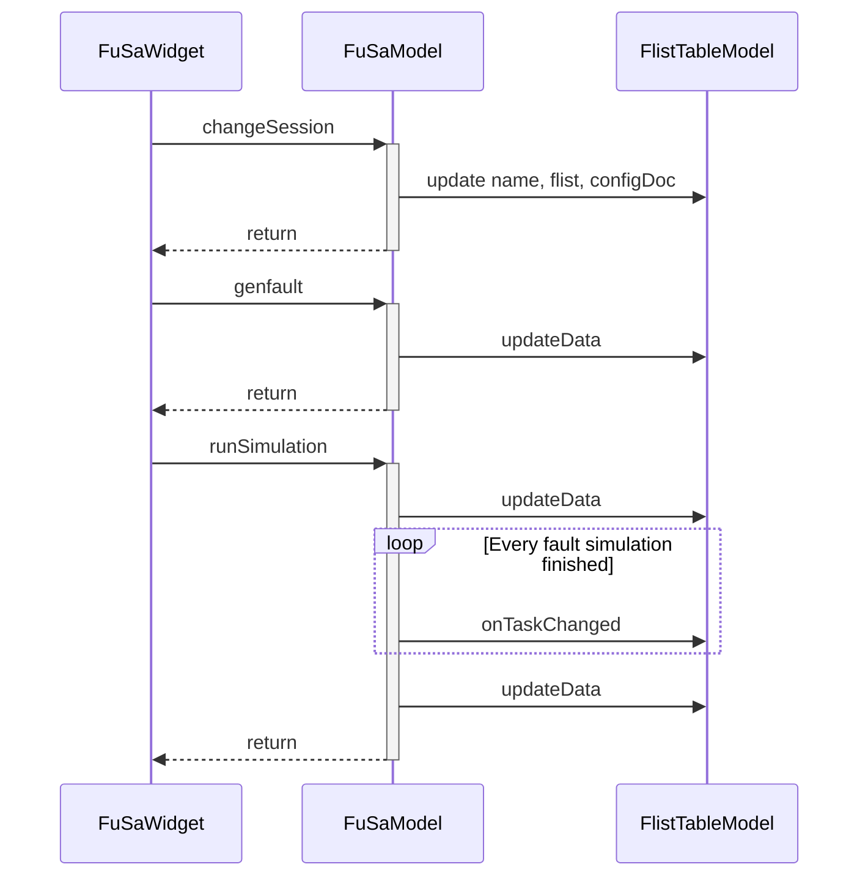
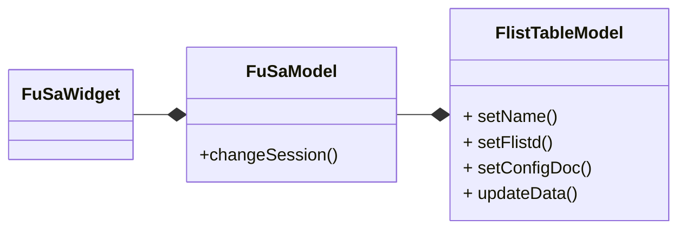
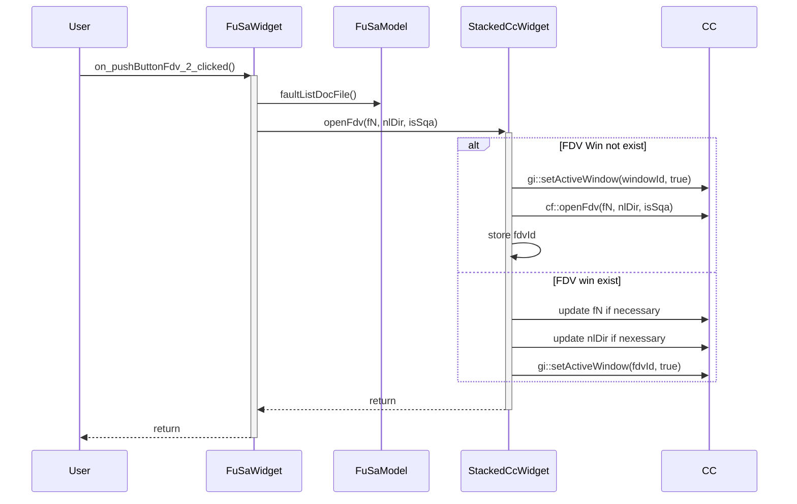

# Metadata
Status 
Type ::  #CF/GUI 
Topics :: 
# Note
## tableViewFlist
### sequence diagram

```mermaid
sequenceDiagram
participant FuSaWidget
participant FuSaModel
participant FlistTableModel
FuSaWidget ->>+ FuSaModel: changeSession
FuSaModel ->> FlistTableModel: update name, flist, configDoc
FuSaModel -->>- FuSaWidget : return
FuSaWidget ->>+ FuSaModel: genfault
FuSaModel ->> FlistTableModel: updateData
FuSaModel -->>- FuSaWidget : return
FuSaWidget ->>+ FuSaModel: runSimulation
FuSaModel ->> FlistTableModel: updateData
loop Every fault simulation finished
  FuSaModel ->> FlistTableModel: onTaskChanged
end 
FuSaModel ->> FlistTableModel: updateData
FuSaModel -->>- FuSaWidget : return
```
### class diagram

```mermaid
classDiagram
direction LR
class FuSaWidget
class FuSaModel {
  +changeSession()
}
class FlistTableModel {
+ setName()
+ setFlistd()
+ setConfigDoc()
+ updateData()
}
FuSaWidget --*FuSaModel 
FuSaModel --* FlistTableModel
```
## FDV
### sequence diagram

```mermaid
sequenceDiagram
participant User
participant FuSaWidget
participant FuSaModel
participant StackedCcWidget
participant CC
User ->>+ FuSaWidget : on_pushButtonFdv_2_clicked()
FuSaWidget ->> FuSaModel : faultListDocFile()
FuSaWidget ->>+ StackedCcWidget : openFdv(fN, nlDir, isSqa)
alt FDV Win not exist
  StackedCcWidget ->> CC : gi::setActiveWindow(windowId, true)
  StackedCcWidget ->> CC : cf::openFdv(fN, nlDir, isSqa)
  StackedCcWidget ->> StackedCcWidget: store fdvId
else FDV win exist
  StackedCcWidget ->> CC : update fN if necessary
  StackedCcWidget ->> CC : update nlDir if nexessary
  StackedCcWidget ->> CC : gi::setActiveWindow(fdvId, true)
end
StackedCcWidget-->>- FuSaWidget : return
FuSaWidget-->>- User : return
```