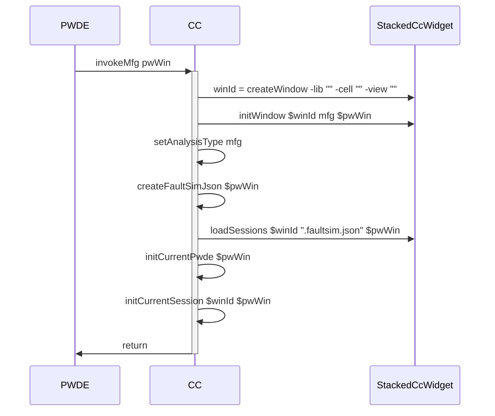
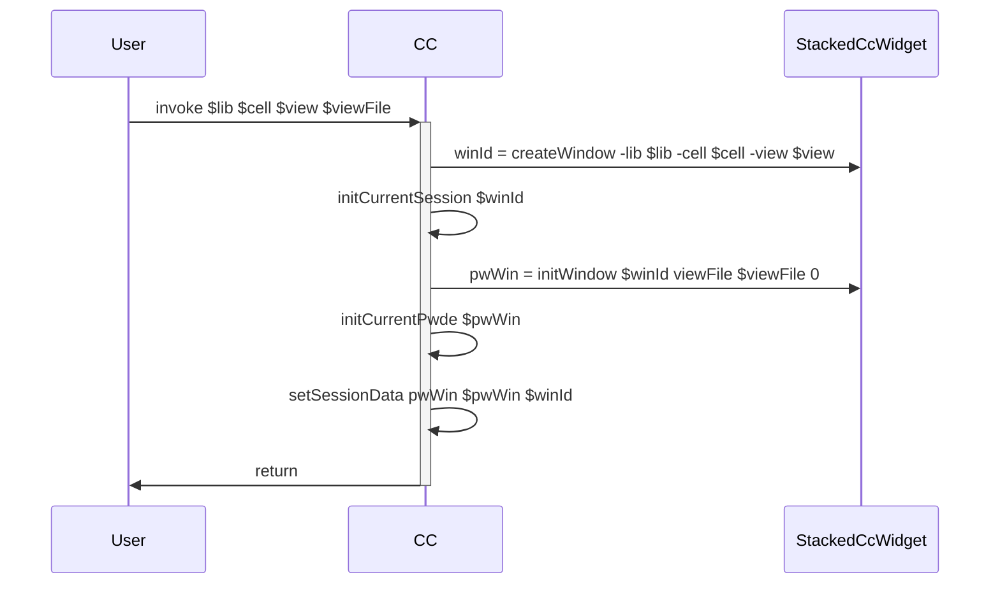
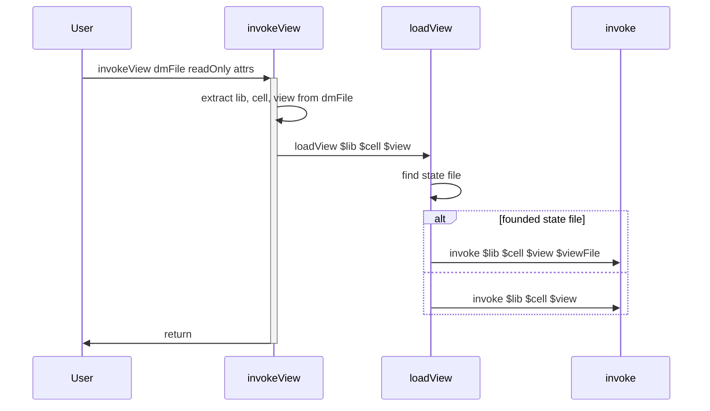
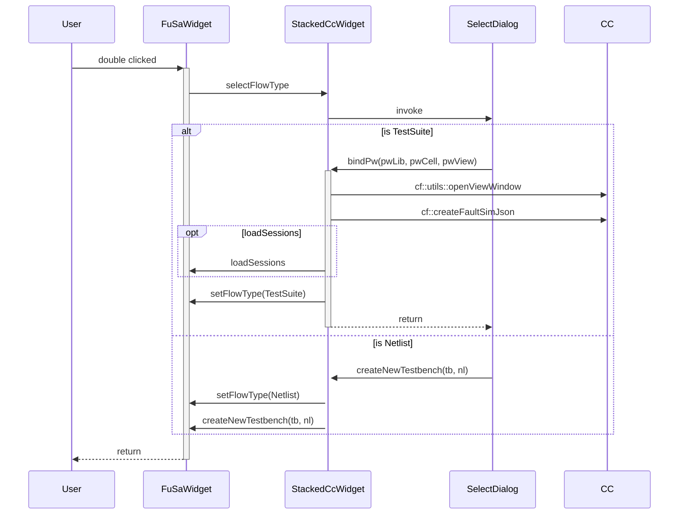
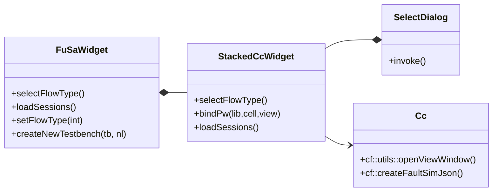
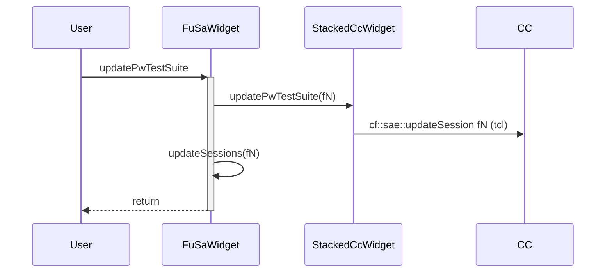
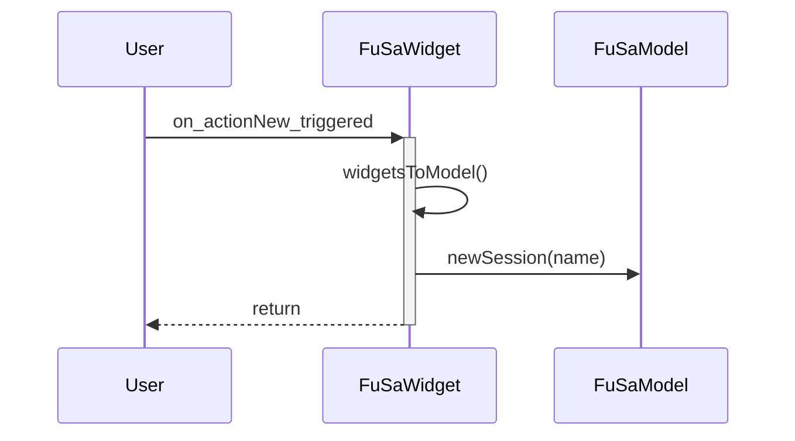
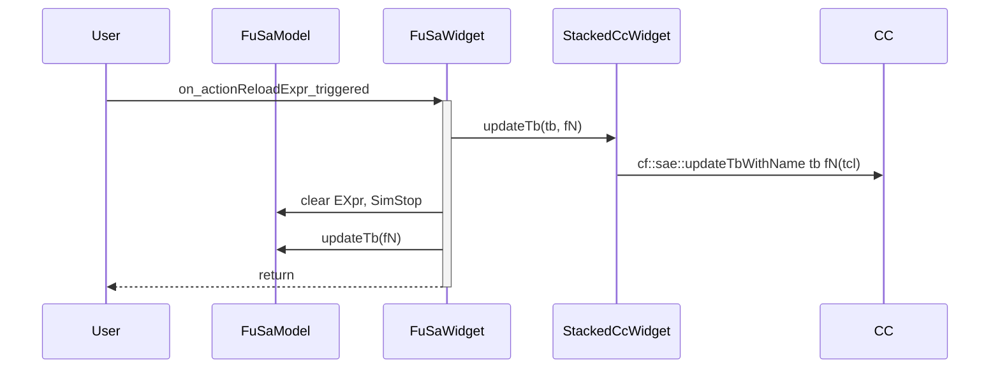

<---
date : 2022-05-04 09:49
aliases : []
priority : 5
---
# Metadata
Status :: #Status/Info
Type :: #CF/GUI 
Topics :: # Metadata
# Note
## From PWDE, invokeMfg, FuSa, SiRa
* in cf_sae_link.tcl, cf::showMenu define menus and correpoding functions
	* cf::stacked::invokeMfg
	* cf::stacked::invokeFuSa
	* cf::stacked::invokeSiFa

## From click on CC customfault icon
* for icon we use "cf::stacked::invoke"

* code in loadLib.tcl, oa::... define customfault view and the entry point is cf::stacked::invokeView

## double click on session panel
### first time, need to select flow
#### Sequence diagram

#### Calass diagram

### PW test suite flow

### netlist flow

## PushButtons
### Reload Expr

