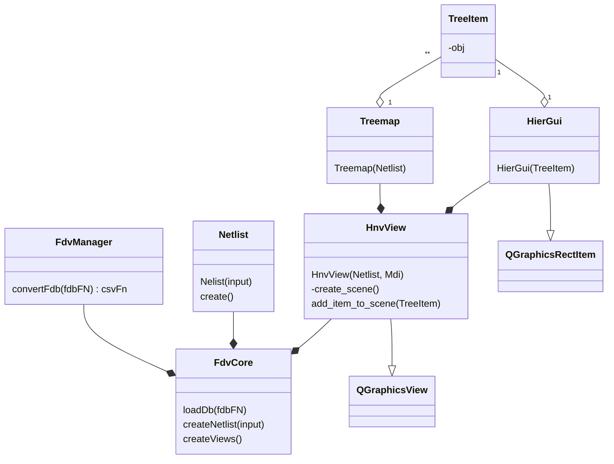
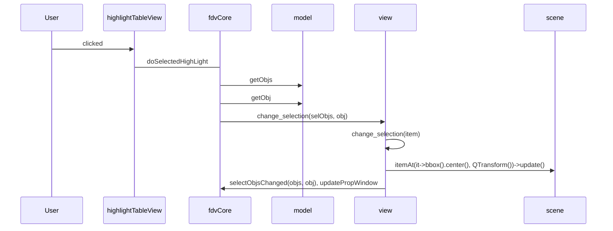
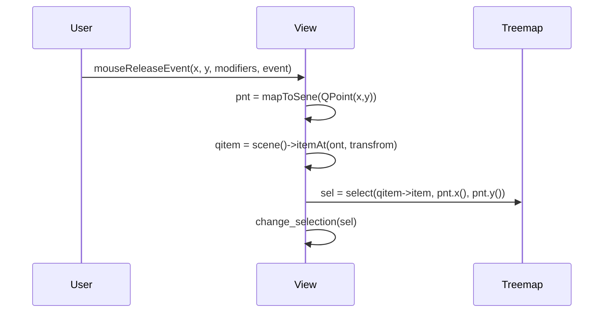

ddate : 2023-04-20 14:07
priority : 1
---
# Metadata
Status ::
Type ::
# Question
# Answer
# Note
## Class FdvCore
```python
def loadDb(fdbFN):
	csvfiles_.clear();
	csvfiles_.append(strDb);
	openDbs(csvfiles_, tb);
	
def opDbs(csvfiles_, tb)
	csvFN = fdvm_.covertFdb(csvFiles_[0])
	input.addCsvFile(csvFN)
	readNetlistFiles(input)
	initPropertyDatabase() # add propeties for annotation
	dbOpened(isValidFdb)
	
	
def readNetlistFiles(input):
	netlist_ = createNetlist(input)
	createViews()
	if propWidget_:
		pass
	setCategoryVisible(netlist_->has_coverage_info() or netlist_->has_fault_model())
	
def createNetlist(input):
	netlist = Netlist(input)
	netlist.create()
	return netlist

def createViews():
	gmdView_ = createNewView(GMD_MODE);
	gmdView.dumpCfLog.connect(self.dumpCfLog)
	gmdView_->showMaximized()
	zoomFit()
def zoomFit():
	curView_.zoomFit()
def createNewView(mode) :
	view = HnvView(netlist_, mode, mdi_, False)
	view.selectObjsChanged.connect(self.updatePropWindow)
	view.traceChanged.connect(self.updateStatusBar)
	view.selectObjByView.connect(self.clearTableViewSelection)
	flags = Qt.WindowTitleHint | Qt.CustomizeWindowHint | Qt.WindowMinMaxButtonsHint
    mdi_.addSubWindow(view, flags);
	curView_ = view;
	if fdvm_:
	    std::string szTemp = getFdbFileName() if getFdbFileName() else getSqadbFileName()
	    curView_->setWindowTitle(QString::fromStdString(szTemp))
	view->show();
	return view;
```
## class HnvView(QGraphicsView)
``` python
def __init__(netist, mode, parent, isCompareMode):
	netlist_ = netlist
	mode_ = mode
	init()
	create_scene()
	zoomFit()
	zoomOut()

def init() :
	setOptimizationFlags(QGraphicsView::DontSavePainterState)
	horizontalScrollBar().setStyleSheet("QScrollBar {height:0px;}")
	verticalScrollBar().setStyleSheet("QScrollBar {width:0px;}")
	setBackgroundBrush(_c_background)
	zoomFit()
	zoomOut()
def create_scene():
	_scene = QGraphicsScene(self)
	setScene(_scene)
	_treemap = Treemap(_netlist, mode_ == NODE_MODE, isCompareMode_)
	bbox = _treemap.bounding_box();
	_scene.setSceneRect(bbox.x(), bbox.y(), bbox.width(), bbox.height());
	_scene.setBspTreeDepth(10);
	add_item_to_scene(_treemap->root_item(), NULL)
	
def zoomFit():
	fitInView(_scene.sceneRect(), Qt::KeepAspectRatio)
def zoomOut():
	scale(1 / _scale_factor, 1 / _scale_factor) # 1.2
def add_item_to_scene(item, gparent):	
	gui = HierGui(item, gparent)
	if (not _top_gui):
	    _top_gui = gui
	if (not gui.parentItem()):
	    _scene->addItem(gui);
	++_n_item;
  	if (not item->child_is_qt_item()):
	    return;
	child = item->first_child()
	while (child) :
		add_item_to_scene(child, gui)
		child = child->sibling
```
## class HierGui(QGraphicsRectItem)
```python
def __init__(self. item, parent):
	self.__super()__.__init__(parent)
	self._item = item
	setRect(item.bbox());
	setFlags(QtGuiItem.ItemIsSelectable);
```
## class Treemap(TreemapPrivate)
```python
def __init__(netlist, use_node, persistGeo):
	super().__init__(netlist, use_node, persistGeo)
	build_item_tree()
def build_item_tree():
	geo_ = TreemapGeo(netlist_, use_node_)
	geo_.init()
	build_tree()
	
def vuild_tree():
	_nnox = _geo.bounding_box()
	_root = create_item(_netlist.top_inst(), _geo)
	build_item_tree(_root, *_geo)
def build_item_tree(parent_item, geo):
	parent_inst = parent_item._obj
	last_item = None
	for obj in parent_inst->child_insts():
		item = create_item(obh, geo)
		if not last_item:
			parent_inst.first_child = item
		else:
			last_item->sibling = item
		last_item = item
		build_item_tree(item, geo)
	for obj in parent_inst->gmds():
		item = create_item(obj, geo)
		if not last_item:
			parent_inst.first_child = item
		else:
			last_item->sibling = item
		last_item = item
		targetList = _netlist.get_n2n_objs(item.obj())
		for target in targetList:
			item->_relatives.append(obj2item(target))
		
def create_item(obj, geo):
	rect = geo.bbox_of(obj)
	item = obj2item(obj)
	item._bbox = rect
	item.color = COLOR_OF_INST
	update_color()

```
## class TreemapGeo
``` python
def __init__(netlist, use_node):
	netlist_ = netlist
	_bbox = Rect()
	n_bbox_inst_ = netlist_.num_inst()
	n_bbox_leaf = netlist_.num_gmd()
	bbox_all_ = bbox_insts = [QRect()] * (_bbox_all + n_bbox_leaf)
	bbox_leaves_ = bbox_insts[_n_bbox_inst:]
def init():
	netlist_.assign_weight_by_gmd()
	resolution = 100
	sw = sqrt(_netlist.top_inst().weight()) * resolution
	sh = sw * 0.75
	_bbox.setRect(0, 0, sw, sh)
	top_inst = _netlist.top_inst()
	_do_squarify_recur(top_inst, _bbox)
	
def _do_squarify_recur(inst, bbox):
	_bbox_insts[inst.id()] = bbox
	child_groups = get_child_groups(inst, _use_node)
	if not child_groups:
		return
	harr = []*len(child_groups)
	for i in range(len(child_groups)):
		harr[i].idx = i
		group = child_groups[i]
		harr[i].weight = 0 if !group else group.front().weight() * group.size()
	squarify(bbox, inst->weight(), false, harr)
	for h in harr:
	    rect = h.bbox;
	    objs = child_groups.at(h.idx);
	    if (! _use_abs_coord):
			rect.adjust(-bbox.x(), -bbox.y(), -bbox.x(), -bbox.y());
	    _do_squarify_one_group_recur(objs, rect, h.weight);

def squarify(org_bbox, org_sum_weight, False, harr) :
	if len(harr) == 1:
		harr.front().bbox = org_bbox
		return
	harr = sorted(harr)
	prev_list = []
	prev_list_weight = 0
	latest_ratio = 0
	bbox = org_bbox
	bbox_weight = org_sum_weight
	by_row = bbox.width() >= bbox.height()
	for h in harr:
		maxw = bbox.width() if (bbox.width() >= bbox.height()) else bbox.height()
	    minw = bbox.height() if (bbox.width() >= bbox.height()) else bbox.width()	
	    prev_list_weight += h.weight
	    ratio = prev_list_weight / bbox_weight * (prev_list_weight / h.weight) *  (maxw / minw)
	    if (ratio < 1):
			ratio = 1.0 / ratio
		prev_list_weight -= h.weight
		if (!prev_list.empty() and ratio > latest_ratio	):
			layout(bbox, bbox_weight, by_row, prev_list, prev_list_weight, harr)
			delta =  prev_list_weight / bbox_weight * maxw
			if by_row:
				bbox.setX(bbox.x() + delta)
			else:
				bbox.setY(bbox.y() + delta)
			bbox_weight -= prev_list_weight	
			prev_list.clear();
			prev_list_weight = 0;

	  
			maxw = (bbox.width() >= bbox.height() ? bbox.width() : bbox.height());
			minw = (bbox.width() >= bbox.height() ? bbox.height() : bbox.width());
			ratio = (double) h.weight / bbox_weight * ((double) maxw / minw);
			if (ratio < 1):
			    ratio = 1.0 / ratio;
	    latest_ratio = ratio;
	    prev_list.push_back(i);
	    prev_list_weight += harr.at(i).weight;
	if (! prev_list.empty())
	    layout(bbox, bbox_weight, by_row, prev_list, prev_list_weight, harr);
def layout(bbox, bbox_weight, by_row, arr, arr_weight, harr):
	maxw = (by_row ? bbox.width() : bbox.height());
	minw = (by_row ? bbox.height() : bbox.width());
	fixed_w = (double) arr_weight / bbox_weight * maxw;
	y = bbox.y();
	x = bbox.x();
	for i in range(len(arr):
		h = harr.[arr.[i]];
	    rect = h.bbox;
	    rect = bbox;
	    wh = (double) h.weight / arr_weight * minw;
	    if by_row:
			rect.setWidth(fixed_w);
			rect.setY(y);
			rect.setHeight(wh);
			y += wh;
	    else:
			rect.setHeight(fixed_w);
			rect.setX(x);
			rect.setWidth(wh);
			x += wh;
		  
def get_child_groups(inst, use_node):
	if not inst:
		return None
	groups = group_child_insts_by_subckt(inst)
	nodes = get_child_nodes(inst, use_node)
	if nodes:
		groups.append(nodes)
	return groups
def group_child_insts_by_subckt(inst):
	if not inst or not inst.num_child_inst():
		return None
	num_child = inst.num_child_inst()
	objs = []
	for i in range(num_child) :
		child = inst->child_inst(i)
		if child.weight() == 0:
			continue
		objs.append(child)
	last_subckt = -1
	for i in range(len(objs)):
		subckt_id = objs[i]->subckt()->id()
		if last_suckt != subckt_id:
			groups.append([])
			last_subckt = subckt_id
		groups[-1].append(objs[i])
	return groups

def get_child_nodes(inst, use_node):
	nodes = []
	for e in inst.gmds() :
		nodes.append(e)
		return nodes
```
## class TreemapPrivate
```python
def __init__(netlist, use_node, keep_geo):
	netlist_ = netlist
	keep_geo_ = keep_geo
	use_node_ = use_node
	n_inst_ = netlist_.num_inst()
	n_leaf_ = netlist_.num_gmd()
	# in C, prepare memory for TreemapItem's
```
## class Netlist
``` python
def __init__(self, input):
	self.input = input
def create():
	create_sbckts()
	create_insts_after_subckts();
	read_property_in_creation()
def read_property_in_creation():
	for fN in _input.csv_files:
		read_property_from_csv(fN)
def read_property_from_csv(fN):
	m = parse_csv_header(file, _input.csv_prop_identifier(fN))
	with open(fN) as f:
		for line in f:
			read_property_from_csv_sub(line, m)
	for obj1, port2s in _net_map.items():
		for port2 in port2s:
			_net_obj_map[obj1].append(_net_name_to_obj[port2])		
	_net_name_to_obj = {}
def read_property_from_csv_sub(line, m):
	words = line.split(',')
	obj = find_obj_by_hier_name(words[0], m)
	bool is_n2n_short = False
	for i in range(1, len(words)):
		word = words[i]
		prop = _props[i]
		prop_name = prop.name()
		if is_n2n_short:
			if prop_name == 'port1' :
				_net_name_to_obj[word] = obj
			if prop_name == 'port2' ;
				_net_map[obj].append(word)
		prop.add(obj, word)
		if prop_name == 'type' :
			if word == 'net_to_net_short' :
				is_n2n_short = true
			_typeSet.add(word)
			
def create_insts_after_subckts():
	_top_subckt->assign_weight(GMD_MODE)
	_top_inst = new Inst(id1, NULL, _top_subckt)
	_insts[id1] = _top_inst
	create_nodes(_top_inst)
	create_gmds(_top_inst)
	for i in range(_top_subckt->num_child_subckt()):
		inst = create_child_inst(_top_inst, i);
		_top_inst.add_child_inst(inst);

def create_child_inst(parent, subckt_reference_id):
	id1 = _num_inst++
	inst = Inst(id1, parent, subckt_reference_id);
	_insts[id1] = inst;
	if _max_inst_depth < inst.depth():
		_max_inst_depth = inst.depth();
	create_nodes(inst);
	create_gmds(inst);
	for i in range(inst.subckt().num_child_subckt()):
		child = create_child_inst(inst, i);
		inst.add_child_inst(child);
    return inst;
def create_subckts():
	self.subDict = {}
	self.modelDice = {}
	create_fake_subckts_from_csv()
	self.subDict = {}
	self.modelDice = {}
	
def create_fake_subckts_from_csv():
	_csv_hlpr = CsvHelper()
	for  i in range len(input.csvFiles):
		prop_identifier = "" if i == 0 else '|' + str(i)
		fN = input.csvFiles[0]
		mode = parse_csv_header(fN)
		if mode == GMD_MODE:
			_csv_hlpr.add_gmd_csv(fN)
	_csv_hlpr.convert_csv()
	_num_subckt = _csv_hlpr->num_subckt()
	_subckts.resize(_num_subckt)
	for i in range(_num_subck):
		is_top = _csv_hlpr.get_subckt(i, name, models, pins, child_subckts)
		subckt = new Subckt(i, name, true)
		_subckts.append(subckt)
		if is_top:
			_top_subckt = subckt
		_subcktDict[name]=i
		subckt->add_modle()
		subckt->add_pin()
		subckt->add_child_subckt()
		_csv_hlpr = None
def parse_csv_header(fN)
	with open(fN) as f:
		line1 = f.readline().strip()
		line2 = f.readline().strip()
	names = line1.spit(',')
	if names[0] == 'gmd':
		mode = GMD_MODE
	else: # node
		mode = NODE_MODE
	types = line2.split(',')
	vec_types =[]
	for t in types:
		tt = NONE
		if t == 'bool' :
			tt = BOOL
		else if t == 'string' :
			tt = STRING
		vec_types.append(tt)
	for i in range(1,len(names)):
		prop = find_property(names[i])
		if prop :
			if prop.type != vec_types(i) :
				Error
		else:
			prop = add_property(names[i], m, vec_types[i])
	return mode
def add_property(key, mode, type): # need check when used
	id = len(_props)
	return
```
## class CsvHelper
```python
def __init__(self):
	self.instdict={}
	self.insts = []
	self.n_inst = 0
def add_gmd_csv(fN):
	self.gmd_files.append(fN)
def convert_csv():
	max_depth = split_csv_file() # write csv file to different depth file
	for i in reversed(range(max_depth)):
		fN = _get_split_csv_file_name(i)
		create_fake_insts(fN)
		finish_insts(0)
		for inst in self.insts_prev:
			subckt = create_fake_subckt_from_inst(inst) # in old ntv, it may store the subckt name at last
			if i > 1:
				create_fake_parent_from_inst(inst, subckt)
		finish_insts(1)
	finish_insts(2)
	os.remove(split_csv_files)
def create_fake_parent_from_inst(inst, subckt):
	parent_name, inst_name = inst_name.rsplit(',', 1)
	parent = find_inst(parent_name)
	if not parent:
		parent = new_inst(parent_name)
	parent._ckt_rep = parent->_ckt_rep + ',S0=mos_mac_short_GS'
	return parent
def create_fake_subckt_from_inst(inst):
	# create subckt from ins._ckt_rep, seems not correct
	return subckt
		
def create_fake_insts(fN):
	with open(fN) as f:
		for line in f:
			line = line.strip()
			inst_name, node_name = line.rsplit(',',1)
			if not inst_name in self.instDict:
				inst = new_inst(inst_name)
			else:
				inst = self.instDict[inst_name]
			inst.n_child ++
			inst.ckt_rep = inst.ckt_rep + ',' + node_name
			
def new_inst(inst_name):
	self.n_inst++
	inst = FakeInst(inst_name)
	self.insts.append(inst)
	self.instDict[inst_name] = self.n_inst
	return inst
def finish_insts(pass):
	if pass == 0:
		self.instDict = {}
		self.insts_prev = self.insts
	elif pass == 1:
		self.insts_prev =[]
	else:
		self.insts = []
def get_subckt(i, name, models, pins, children):


```
## class FakeInst
```python
def __init__(self, name) :
	self.name = name
	self.ckt_rep = ''
	slef.n_child = 0
```
## Class diagram

## Fdv gui operation flow
### click on HighlightTableView 

### click on View

## NCA module
### column
* header
	* group id , defect id | count, name | weight
* internal variable: vector<vector<vector\<string>>> defects_
	* level 0 : groups
	* level 1: defects
	* level 3: data, 0: cluster weight, 1: wieight, 2: id, 3: name, 4: cmd