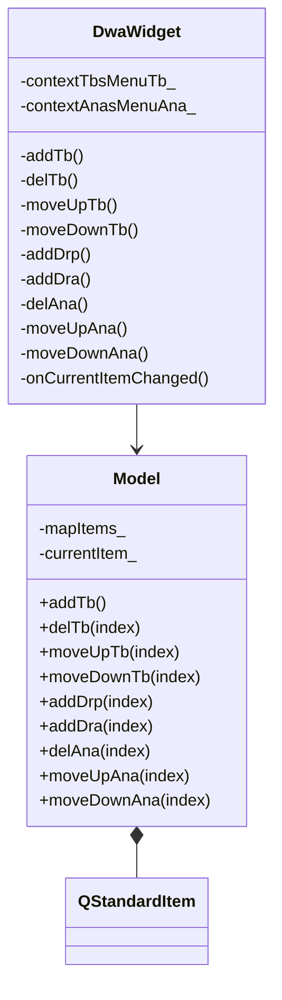
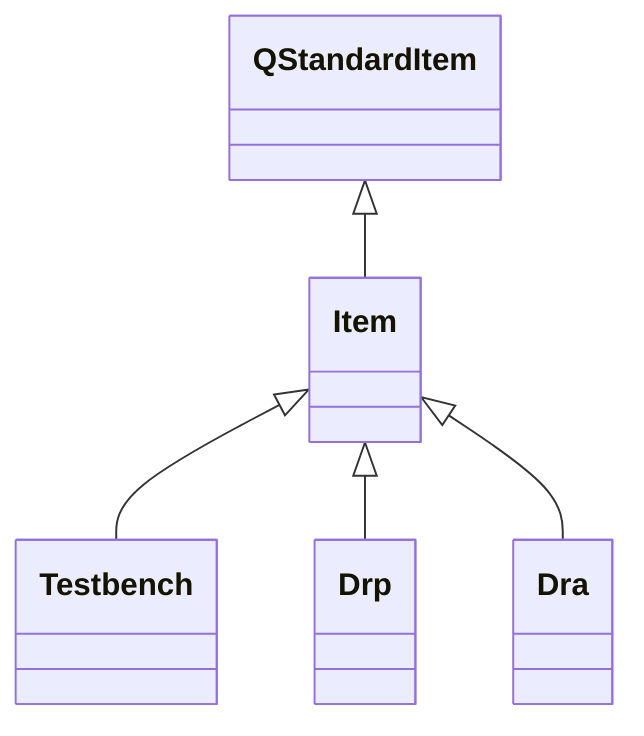

# Metadata
Status :: #Status/Progress 
Type :: #DR/GUI
Summary :: 
Topics :: 
# Note
## Dr build
```bash
cd <p4_client>/csim/src/code/dwa>
synmake IS_DWA=1 install-linux64
```
## Dr usage
```bash
primesim_dr -json tt.json -t drp1 -o tt/tt # outpt is tt/tt_drp1.db
primesim_dr -drp histogram -i input.db -type vth
```
## TCL function needed by C side
### dwa
* dwa::isInReplay
	* return : 0: not in replay, other : in replay
### dwa::stacked
* dwa::stacked::dumpDwaLog id cmd
	* id : window id
	* cmd : cmd list join with ","
	* write "dwa::stacked::dwaReplay id cmd" to log file when not in replay more
* dwa::stacked::reset
	* do no thing yet
* dwaReplay id cmd
	* when in replay mode, call "dwa::stacked::replay id cmd" (tcl - c function)
### dwa::utils
* dwa::utils::getDmFileName lib cell view
	* from leb cell view, find dm file 
	* return dm file(dwa.file)
* dwa::utils::getLibNames
* dwa::utils::getCellNames lib
* dwa::utils::getViewNames lib cell viewType
	* viewType (dwa, customfault ...)
## TCL functions that start the GUI
### register dwa and call corespoding tcl functions
``` tcl
load [file join [file dirname [info script]] libdwaobject[info sharedlibextension]]
oa::ViewTypeCreate "dwa"
set app [de::createApplication dwaGUI -openProc "dwa::stacked::invokeView" \
  -canCreate true -canOpenMultiple false \
  -title "PrimeWave Custom Fault"]
   
de::createAssociation -application $app -fileName "dwa" -default true \
  -defaultViewName "dwa"

gi::createAppIcon dwa \
  -toolTip "DWA" \
  -label "PrimeSim\nCustom DWA" \
  -icon [db::resolve dwa/dwa_128.png] \
  -execProc {apply {{icon} {
    db::eval {dwa::stacked::invoke} -log true
  }}}

```
### about invoke function
```tcl
  proc invoke { {libName ""} {cellName ""} {viewName ""} {viewFile ""}} {
    set winId [dwa::stacked::createWindow -lib $libName -cell $cellName -view $viewName] # cpp function
    dwa::initCurrentSession $winId
    if {$winId == 0} {
      return
    }
    de::sendMessage "bring up PrimeSim Custom Fault GUI..." -severity information
    set pwWin [dwa::stacked::initWindow $winId viewFile $viewFile 0] # cpp function
    if { $pwWin != 0 } {
      dwa::setSessionData pwWin $pwWin $winId
    }
  }
```
### create CC dwa window (define cpp function for createWindow::execute)
```tcl
namespace eval dwa::stacked::createWindow { # define createWindow::execute cpp function
  set argList {}
  lappend argList [de::createArgument "-lib" \
                       -description "Library name" \
                       -optional 1 ]
  lappend argList [de::createArgument "-cell" \
                       -description "Cell name" \
                       -optional 1 ]
  lappend argList [de::createArgument "-view" \
                       -description "View name" \
                       -optional 1 ]
  de::createCommand [namespace current] \
      -description "Create a new DWA Stacked window" \
      -arguments $argList \
      -category "DWA"
}
```

### cpp function that needed to connect TCL side
* *dwa::stacked::createWindow::execute* (tcl) -> *dwa::CcDwaStacked::create_stacked_window* (cpp)
* *dwa::stacked::initWindow* (tcl) -> *dwa::CcDwaStacked::initWindow* (cpp)
* *dwa::stacked::replay*(tcl) -> *dwa::CcDwaStacked::dwaReplay* (cpp)
## Dr Diagram
### class diagram



